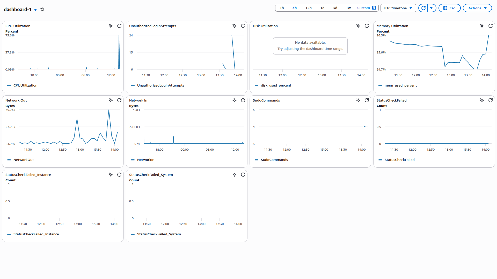

# EC2 CloudWatch Monitoring

Terraform project that deploys an Ubuntu EC2 instance with CloudWatch monitoring, security log collection, a dashboard, and SNS email alerts.


## What it creates

- VPC, public subnet, internet gateway, and SSH-enabled EC2 instance
- CloudWatch Logs group for `/var/log/auth.log`
- CloudWatch dashboard for CPU, memory, disk, network, security, and status checks
- SNS email alerts for high CPU, memory, disk usage, failed SSH logins, and high sudo activity

## Deploy

Requirements: Terraform 1.5+, AWS credentials, and permissions to create EC2, VPC, IAM, CloudWatch, and SNS resources.

```bash
cd terraform
terraform init
terraform plan
terraform apply
```

Confirm the SNS subscription from the email sent by AWS. Retrieve the instance SSH command with:

```bash
terraform output -raw ssh_command
```

## Configure the CloudWatch Agent

The instance installs the agent during provisioning. Copy the included configuration to the server and start it:

```bash
scp -i terraform/ssh-key.pem cloudwatch/amazon-cloudwatch-agent.json \
  ubuntu@<INSTANCE_PUBLIC_IP>:/home/ubuntu/

ssh -i terraform/ssh-key.pem ubuntu@<INSTANCE_PUBLIC_IP>
sudo /opt/aws/amazon-cloudwatch-agent/bin/amazon-cloudwatch-agent-ctl \
  -a fetch-config -m ec2 \
  -c file:/home/ubuntu/amazon-cloudwatch-agent.json -s
```

## Dashboard

The `dashboard-1` CloudWatch dashboard displays EC2, agent, and security metrics.



## Useful files

| Path | Purpose |
| --- | --- |
| `terraform/` | AWS infrastructure and alarms |
| `cloudwatch/amazon-cloudwatch-agent.json` | Agent configuration |
| `scripts/` | CPU-load and failed-login test scripts |
| `docs/` | Dashboard and alert screenshots |

## Cleanup

```bash
cd terraform
terraform destroy
```

> The SSH rule is open to the internet for demonstration. Restrict port 22 to your IP address before using this in a real environment.
